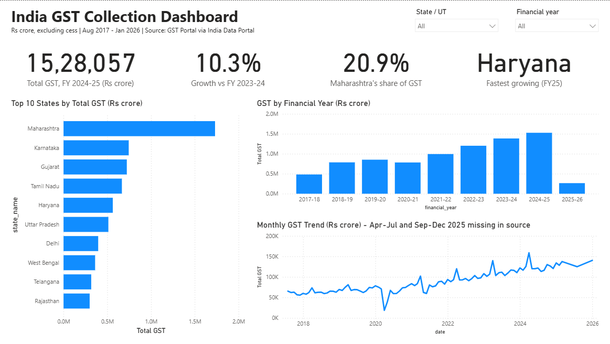

# Data Analytics for Government – My Portfolio

Goal: Get a data analyst / MIS / M&E role on government projects (consulting firms, e-governance bodies, development sector).

Approach: **Learn by building.** Each project teaches one new skill.

## Projects

| # | Project | Skill | Weeks | Status |
|---|---------|-------|-------|--------|
| 01 | [GST Collection Analysis](01-gst-analysis/README.md) | Excel → Power BI | 1–3 | ✅ Done |
| 02 | [Welfare Scheme Analysis (MGNREGA / PM-KISAN)](02-welfare-scheme-analysis/README.md) | SQL | 4–6 | 🟨 In progress |
| 03 | [Education / Health Analysis](03-education-health-analysis/README.md) | Power BI (multi-table) | 7–9 | ⬜ Not started |
| 04 | [Python Data Cleaning](04-python-data-cleaning/README.md) | Python (pandas) | 10–12 | ⬜ Not started |

Status key: ⬜ Not started · 🟨 In progress · ✅ Done · 📢 Shared on LinkedIn

## Folder guide

Each project folder has:
- `data/raw/` – original downloaded files. **Never edit these.**
- `data/clean/` – your cleaned version
- `excel/`, `powerbi/`, `sql/`, `notebooks/` – your work files
- `screenshots/` – dashboard images for LinkedIn and your resume
- `README.md` – questions, steps, and insights for that project

## Free data sources
- data.gov.in – Open Government Data Platform
- gstcouncil.gov.in and pib.gov.in – GST collection statistics
- dbie.rbi.org.in – RBI database
- mospi.gov.in – Statistics ministry
- nrega.nic.in – MGNREGA reports
- udiseplus.gov.in – School education data

## Daily routine (2–3 hours)
- 30 min – learn the one thing the project needs today
- 1.5–2 hours – build
- 15 min – write in `learning-notes/notes.md`
